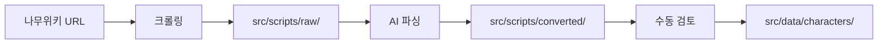

# 🕷️ 나무위키 크롤링 & AI 파싱 가이드

> **Identity json 데이터 자동 생성 시스템**  
> 나무위키 크롤링 → AI 파싱 → 구조화된 JSON 데이터 생성

## 🚀 빠른 시작

### 설치
```bash
npm install
```

### 환경 설정
`.env` 파일에 Claude API 키 설정:
```bash
ANTHROPIC_API_KEY=sk-ant-your-api-key-here
```

## 📖 사용법

### 🎯 원클릭 크롤링 + AI 파싱 (권장)
```bash
npm run crawling "나무위키_URL"
```

**예시:**
```bash
# 뫼르소 엄지 인격 크롤링
npm run crawling "https://namu.wiki/w/%EB%AB%BC%EB%A5%B4%EC%86%8C/%EC%9D%B8%EA%B2%8C%EC%9E%84%20%EC%A0%95%EB%B3%B4#s-2.3.7"

### 🤖 텍스트 파일만 AI 파싱
```bash
npm run parse-identity-ai src/scripts/raw/파일명.txt
```

## 📁 새로운 폴더 구조

```
src/scripts/
├── raw/                              # 📄 크롤링된 원본 텍스트
│   └── character_data.txt            # 기타 텍스트 파일들
├── converted/                        # 🤖 AI 변환된 JSON
│   └── character_data_converted.json      # 자동 파일명 생성
├── ai_parser.js                      # 🧠 AI 로직 모듈
├── parse_identity_ai.js             # 🔧 메인 파서
└── pure-namuwiki-crawler.js         # 🕷️ 크롤러
```

### 🎮 스킬 데이터 구조
```json
{
  "skill1": {
    "skilltype": "공격",        // "공격" 또는 "수비"
    "skill": "s1",              // "s1", "s2", "s3", "def"
    "coin": 2,                  // 코인 개수
    "name": "스킬명",
    "level": "56(+4)",          // 레벨 표기
    "type": "타격",             // 공격 타입
    "prop": "우울",             // 죄악 속성 (한글)
    "power": 3,                 // 기본 위력
    "coinpower": 4,             // 코인 위력 (숫자만)
    "weight": 1,                // 코인 가중치
    "hit": {
      "start": "스킬 시전 시 효과",
      "h1": "첫 번째 코인 적중 시 효과",
      "h2": "두 번째 코인 적중 시 효과",
      "h3": "세 번째 코인 적중 시 효과",
      "h4": "",
      "h5": "",
      "end": "스킬 종료 시 효과"
    }
  }
}
```

### 🔥 강화 스킬 지원
```json
{
  "sync3": {
    "skill1": { /* 기본 스킬 */ },
    "skill2": { /* 기본 스킬 */ },
    "skill3": { /* 기본 스킬 */ },
    "def": { /* 수비 스킬 */ },
    "EnhancementSkill1": [{ /* 강화 스킬1 배열 */ }],
    "EnhancementSkill2": [{ /* 강화 스킬2 배열 */ }],
    "EnhancementSkill3": [{ /* 강화 스킬3 배열 */ }],
    "EnhancementDef": [{ /* 강화 수비스킬 배열 */ }]
  }
}
```

## 🔄 전체 워크플로우



### 1단계: 나무위키 크롤링
- **자동 CAPTCHA 처리**: 수동 해결 후 자동 진행
- **섹션별 추출**: URL의 `#s-2.3.7` 등 섹션 자동 인식
- **Monaco 에디터**: 클립보드 방식으로 정확한 텍스트 추출

### 2단계: AI 파싱 (Claude Sonnet 4)
- **구조화된 프롬프트**: 정확한 JSON 구조 생성
- **자동 검증**: 파싱된 데이터 품질 검사
- **오류 처리**: 실패 시 Raw 응답 저장

### 3단계: 결과 확인 및 이동
- **src/scripts/converted/** 에서 결과 확인

## 🛠️ 고급 사용법


### 🔧 크롤러 설정 커스터마이징
```javascript
// pure-namuwiki-crawler.js 설정
const config = {
  headless: false,        // 개발시: false, 배포시: true
  slowMo: 100,           // 브라우저 속도 조절
  timeout: 30000         // 페이지 로드 타임아웃
};
```

### 🤖 AI 파서 설정
```javascript
// ai_parser.js에서 모델 변경 가능
model: 'claude-sonnet-4-20250514'  // 최신 모델 사용
```

## 📊 데이터 검증 및 품질 관리

### ✅ 자동 검증 항목
- 필수 필드 존재 여부
- 데이터 타입 정확성
- 스킬 구조 완성도
- 강화 스킬 인식도

### ⚠️ 수동 확인 필요 항목
- 스탯 수치 (레벨, 위력, 속도 등)
- 스킬 효과 텍스트 정확성
- 패시브 설명 완성도
- 키워드 적절성

## 🚨 주의사항 및 제한사항

### 🌐 나무위키 관련
- **CAPTCHA**: 수동 해결 필요 (자동 감지 및 대기)
- **편집 권한**: 일부 문서는 편집 제한 가능
- **서버 부하**: 적절한 간격으로 사용 권장

### 🤖 AI 파싱 관련
- **API 키 필수**: Claude API 키 설정 필요
- **토큰 제한**: 매우 긴 텍스트는 잘릴 수 있음
- **파싱 정확도**: 복잡한 구조는 수동 검토 권장

### 💾 데이터 관리
- **백업**: 원본 텍스트는 항상 보존
- **버전 관리**: 변환된 JSON은 덮어쓰기 주의
- **파일명**: 특수문자 포함 시 자동 정리

## 🔍 트러블슈팅

### 크롤링 실패
```bash
# 브라우저 권한 문제
npm run crawling  # 클립보드 권한 허용 확인

# CAPTCHA 해결 안됨
# → 브라우저에서 수동으로 해결 후 진행
```

### AI 파싱 실패
```bash
# API 키 확인
echo $ANTHROPIC_API_KEY

# 수동 파싱 재시도
npm run parse-identity-ai src/scripts/raw/파일명.txt
```

### 데이터 품질 이슈
- **src/scripts/converted/** 폴더에서 `_raw.txt` 파일 확인
- **Claude 응답 전체** 를 통해 문제점 파악
- **필요시 프롬프트 수정** 후 재파싱

## 📈 성능 및 통계

### 평균 처리 시간
- **크롤링**: 30초 ~ 2분 (CAPTCHA 포함)
- **AI 파싱**: 10초 ~ 30초
- **전체 프로세스**: 1분 ~ 3분

### 파싱 정확도
- **기본 정보**: 95%+
- **스킬 구조**: 90%+
- **효과 텍스트**: 85%+ (수동 검토 권장)
- **강화 스킬**: 80%+ (복잡도에 따라 차이)

## 🎯 다음 버전 계획 >> 필요할지 ? 

- [ ] **병렬 처리**: 여러 캐릭터 동시 크롤링
- [ ] **GUI 인터페이스**: 웹 기반 크롤링 도구
- [ ] **실시간 검증**: 파싱 중 실시간 품질 체크
- [ ] **자동 배포**: 완성된 데이터 자동 커밋

---

## 📞 지원 및 피드백

**문제 발생 시:**
1. 먼저 이 가이드의 트러블슈팅 섹션 확인
2. 로그 파일 및 오류 메시지 수집  
3. 문의

**개선 요청:**
- 새로운 데이터 필드 추가
- 파싱 규칙 개선
- 성능 최적화 아이디어
